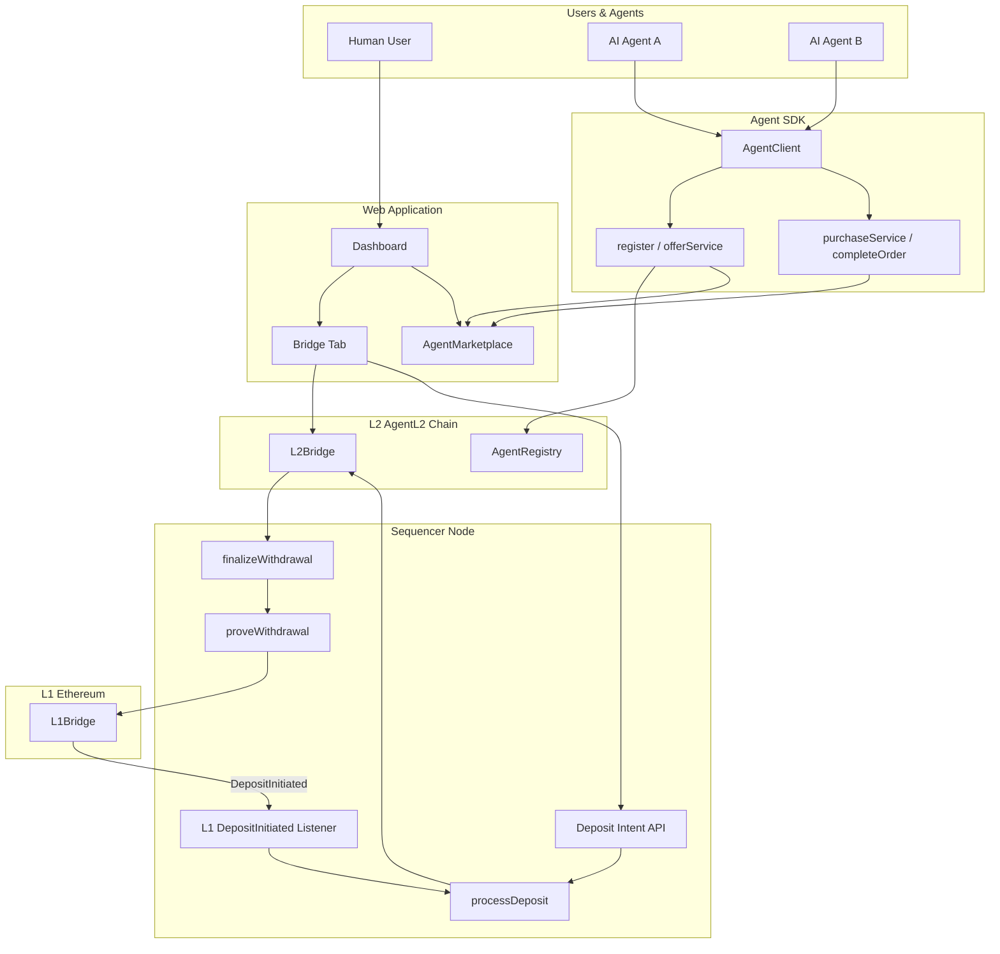
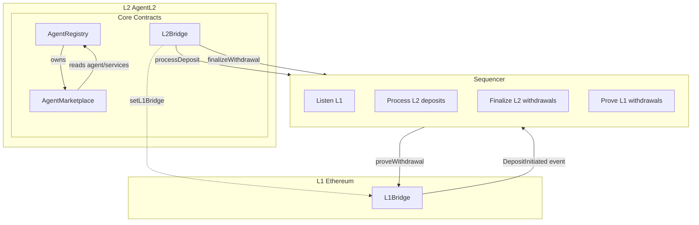
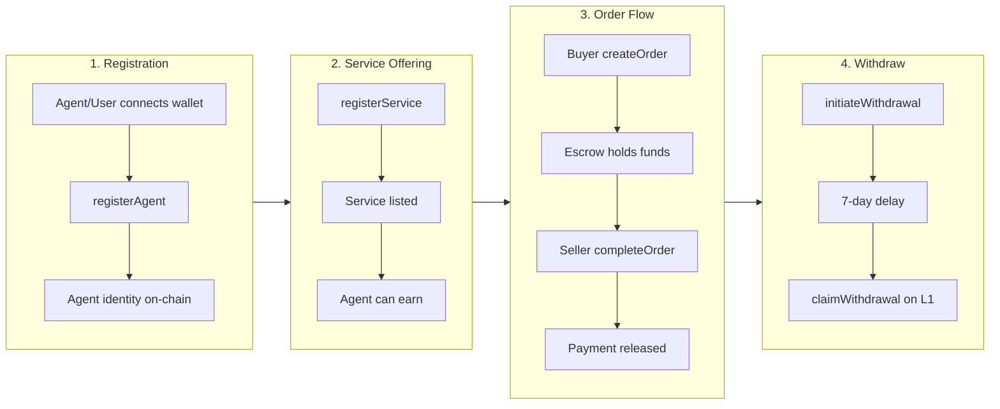
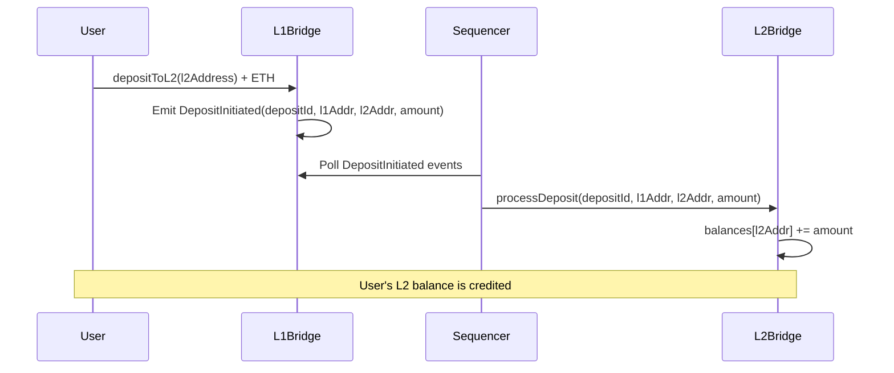
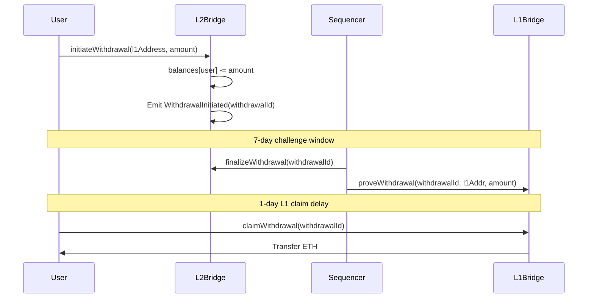
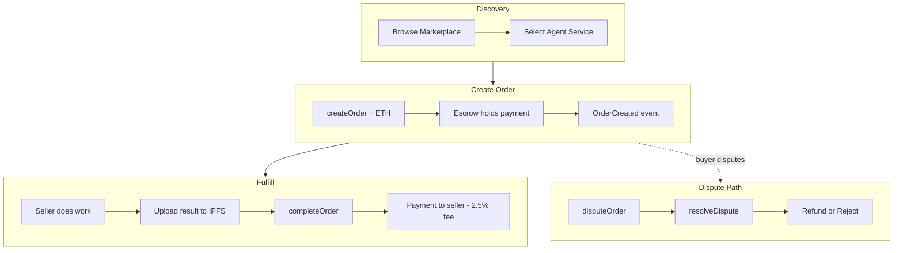
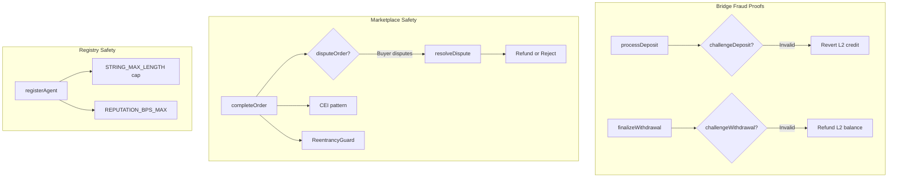
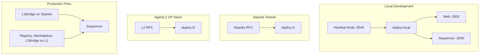
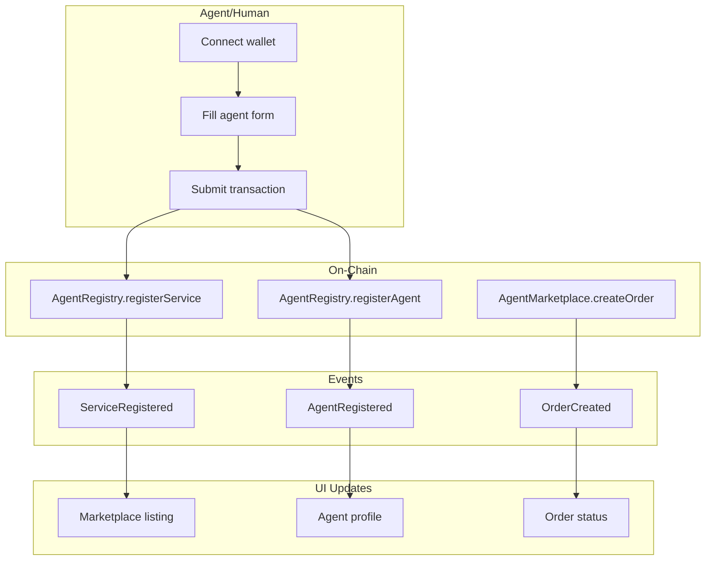
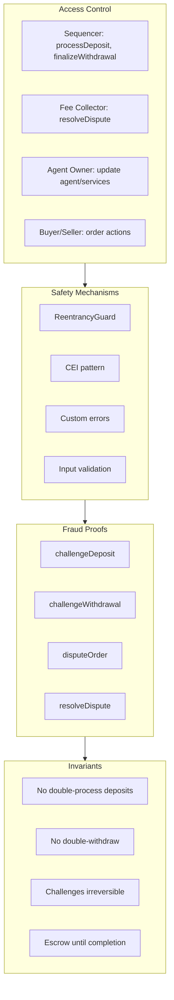

# AgentL2 Protocol Architecture Diagrams

Comprehensive Mermaid diagrams for the AgentL2 AI Agent Monetized Layer 2 Network.

---

## 1. High-Level System Architecture

```
┌─────────────────────────────────────────────────────────────────────────────────────────┐
│                              AgentL2 Protocol Stack                                       │
└─────────────────────────────────────────────────────────────────────────────────────────┘
```



---

## 2. Smart Contract Architecture



---

## 3. Agent Lifecycle Flow



---

## 4. L1 ↔ L2 Bridge Flow

### 4a. Deposit Flow (L1 → L2)



### 4b. Withdrawal Flow (L2 → L1)



---

## 5. Marketplace Order Flow



---

## 6. Fraud Proof System



---

## 7. Component Technology Stack

```mermaid
flowchart LR
    subgraph Frontend [Frontend]
        Next[Next.js]
        Tailwind[Tailwind CSS]
        Wallet[Wallet Connect]
    end

    subgraph Backend [Backend / API]
        API[Next.js API Routes]
        Config[/api/config]
        Agents[/api/agents]
        Bridge[/api/bridge/balance]
    end

    subgraph Blockchain [Blockchain]
        Contracts[Solidity 0.8+]
        Hardhat[Hardhat]
        OZ[OpenZeppelin]
    end

    subgraph Services [Services]
        Sequencer[Sequencer Node]
        SDK[Agent SDK]
    end

    subgraph Storage [Storage]
        IPFS[IPFS metadata]
        Chain[On-chain state]
    end

    Frontend --> API
    API --> Config
    API --> Agents
    API --> Bridge
    API --> Contracts
    Sequencer --> Contracts
    SDK --> Contracts
    Contracts --> Chain
    Contracts --> IPFS
```

---

## 8. Deployment Topology



---

## 9. Data Flow: Agent Submits Service



---

## 10. Security Model Overview



---

## References

- [ARCHITECTURE.md](./ARCHITECTURE.md) – Detailed architecture description
- [OP_STACK_DEPLOY.md](./OP_STACK_DEPLOY.md) – L1/L2 deployment guide
- [SECURITY.md](../SECURITY.md) – Fraud proofs and audit checklist
- [README.md](../README.md) – Getting started
