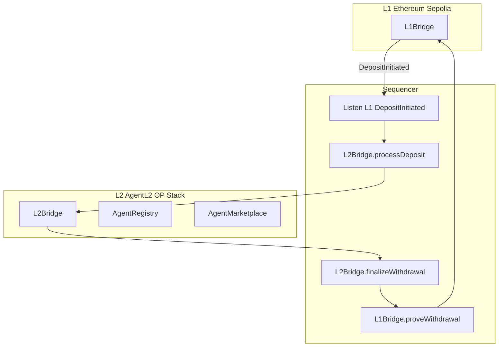

# AgentL2 OP Stack Rollup Deployment Guide

This guide describes how to deploy AgentL2 as a dedicated OP Stack rollup (custom chain) and wire it to the L1 Bridge for real L1-to-L2 deposits and L2-to-L1 withdrawals.

## Architecture



## Prerequisites

- Node.js 18+
- Ethereum Sepolia RPC URL and deployer private key (with Sepolia ETH)
- For OP Stack chain: use opstack-deployer or OP Deployer (see below)

## Step 1: Deploy OP Stack AgentL2 Chain

Use one of the following to create a custom OP Stack rollup:

### Option A: opstack-deployer (Blocktheory)

1. Visit [opstack-deployer.vercel.app](https://opstack-deployer.vercel.app) or clone [Blocktheory/opstack-deployer](https://github.com/Blocktheory/opstack-deployer).
2. Configure:
   - L1: Ethereum Sepolia
   - L2 chain name: AgentL2
   - Sequencer URL (or use default)
3. Deploy. Note the L2 RPC URL and chain ID.

### Option B: OP Deployer (Official)

1. Clone [Optimism monorepo](https://github.com/ethereum-optimism/optimism) or use [OP Deployer docs](https://docs.optimism.io/operators/chain-operators/deploy).
2. Bootstrap Superchain and deploy rollup per official docs.
3. Note the L2 RPC URL and chain ID.

### Option C: Local Dual-Chain (Development)

For local testing without OP Stack:

1. Terminal 1: `npx hardhat node` (L2 at http://127.0.0.1:8545).
2. Deploy L2 contracts: `npm run deploy:l2` (use `--network localhost` if agentl2 points elsewhere).
3. Use Sepolia for L1: deploy L1Bridge with `npm run deploy:l1`.

## Step 2: Deploy L1 Bridge (Ethereum Sepolia)

1. Set in `.env`:
   ```
   PRIVATE_KEY=0x...
   SEPOLIA_RPC_URL=https://rpc.sepolia.org
   ```

2. Deploy:
   ```bash
   npm run deploy:l1
   ```

3. Save the L1Bridge address from `deployment-l1.json`.

## Step 3: Deploy L2 Contracts (AgentL2 Chain)

1. Set in `.env`:
   ```
   PRIVATE_KEY=0x...
   L2_RPC_URL=<your OP Stack L2 RPC>
   L2_CHAIN_ID=<your L2 chain ID>
   ```

2. Deploy:
   ```bash
   npm run deploy:l2
   ```

3. Save the addresses from `deployment-l2.json` (AgentRegistry, AgentMarketplace, L2Bridge).

## Step 4: Configure Sequencer

1. In `sequencer/.env`:
   ```
   L2_RPC_URL=<L2 RPC from Step 3>
   L2_BRIDGE_ADDRESS=<L2Bridge from deployment-l2.json>
   L1_RPC_URL=https://rpc.sepolia.org
   L1_BRIDGE_ADDRESS=<L1Bridge from deployment-l1.json>
   SEQUENCER_PRIVATE_KEY=<deployer private key>
   ```

2. Run:
   ```bash
   npm run sequencer
   ```

The sequencer will:
- Poll L1 for DepositInitiated events and call L2Bridge.processDeposit.
- Poll L2 for finalized withdrawals and call L1Bridge.proveWithdrawal.

## Step 5: Configure Web App

In `web/.env.local` (or extend from deployment output):

```
NEXT_PUBLIC_RPC_URL=<L2 RPC>
NEXT_PUBLIC_CHAIN_ID=<L2 chain ID>
NEXT_PUBLIC_REGISTRY_ADDRESS=<from deployment-l2>
NEXT_PUBLIC_MARKETPLACE_ADDRESS=<from deployment-l2>
NEXT_PUBLIC_BRIDGE_ADDRESS=<L2Bridge from deployment-l2>
NEXT_PUBLIC_L1_BRIDGE_ADDRESS=<L1Bridge from deployment-l1>
NEXT_PUBLIC_L1_RPC_URL=https://rpc.sepolia.org
NEXT_PUBLIC_L1_CHAIN_ID=11155111
```

Run the web app:

```bash
npm run web
```

## Step 6: Deposit and Withdrawal Flow

1. **Deposit (L1 to L2)**: User sends ETH to L1Bridge.depositToL2(l2Address) on Sepolia. Sequencer relays to L2Bridge.processDeposit; user receives L2 balance.
2. **Withdraw (L2 to L1)**: User calls L2Bridge.initiateWithdrawal(l1Address, amount) on L2. After 7-day delay, sequencer finalizes on L2 and proves on L1. User calls L1Bridge.claimWithdrawal(withdrawalId) on L1 after CLAIM_DELAY (1 day).

## Troubleshooting

- **L1 deposits not processed**: Ensure sequencer has L1_RPC_URL and L1_BRIDGE_ADDRESS set and is running.
- **Withdrawals not claimable**: Sequencer must finalize on L2 first; then prove on L1; user must wait CLAIM_DELAY (1 day) before claiming.
- **OP Stack RPC unavailable**: Use Caldera, AltLayer, or similar RaaS for hosted OP Stack chains.
